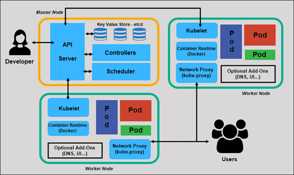

### Monolithic vs Service-Oriented Architecture (SOA) vs Microservices
collapsed:: true
	- | Feature | **Monolithic Architecture** | **Service-Oriented Architecture (SOA)** | **Microservices Architecture** |
	  | --- | --- | --- | --- |
	  | **Definition** | Entire application built & deployed as one unit | Application broken into services but often sharing enterprise bus & central components | Application split into **small, independent** services communicating via APIs |
	  | **Coupling** | **Tightly coupled** | **Loosely coupled**, but still tied by ESB or shared middleware | **Highly decoupled**, each service is autonomous |
	  | **Deployment** | One deployment for whole app | Services deployable but depend on centralized systems | Each service deployed **independently** without affecting others |
	  | **Tech Stack** | Usually single tech stack | Multiple tech stacks possible but limited due to shared infrastructure | Each service can use **fully independent tech stack** |
	  | **Scaling** | Scale entire app even if one part needs scaling | Can scale at service level but heavy ESB slows down | **Independent horizontal scaling** for each microservice |
	  | **Data Storage** | Mostly **single shared database** | Multiple services but may use shared enterprise DB | Each service has its **own database** (decentralized data) |
	  | **Communication** | Function calls in same codebase | Enterprise Service Bus (ESB), SOAP/XML | Lightweight APIs (REST/gRPC, message queues) |
	  | **Failure Impact** | One bug can take down whole system | Better isolation but ESB failure can affect all services | **High isolation** — one service failing doesn’t crash others |
	  | **Speed of Development** | Slower as app grows | Medium | **Fast**, teams independently build and release services |
	  | **Testing** | Easier initially | Moderate complexity | Harder due to distributed system |
	  | **DevOps Needs** | Minimal | Moderate | Needs strong DevOps: CI/CD, containers, orchestration |
	  | **Example Use** | Early-stage startups, small apps | Enterprise-scale apps before microservices era | Large-scale apps like Netflix, Uber, Amazon |
- ### What is Kubernetes and its Architecture?
  collapsed:: true
	- **Kubernetes (K8s)** is an open-source platform that **automatically manages, deploys, scales, and heals containerized applications** (apps running in Docker containers).
	- Kubernetes follows a **Master–Worker architecture**, also called **Control Plane + Worker Nodes**.
	- kubectl is the command-line tool used to talk to the Kubernetes cluster.
	- 
	- ### 🧠 **CONTROL PLANE (Master Node)**
		- ### **1. API Server**
			- ### ⭐ 1-Line Meaning
				- The **gateway** of the cluster — everyone talks to Kubernetes through it.
			- ### ⭐ Technical
				- Exposes REST APIs (`kubectl` uses this).
				- Validates requests, updates etcd, triggers controllers/scheduler.
				- All cluster components communicate through it.
		- ### **2. etcd**
			- ### ⭐ 1-Line Meaning
				- The **database** of Kubernetes.
			- ### ⭐ Technical
				- Distributed key-value store.
				- Stores entire cluster state: nodes, pods, configs, desired state, events.
				- Highly consistent, fault-tolerant.
		- ### **3. Scheduler**
			- ### ⭐ 1-Line Meaning
				- The **decider** that chooses which node runs a Pod.
			- ### ⭐ Technical
				- Picks nodes based on CPU, RAM, taints, affinity rules, node health.
				- Doesn't run pods; only **assigns** them.
		- ### **4. Controllers**
			- ### ⭐ 1-Line Meaning
				- A **robot manager** that keeps actual state = desired state.
			- ### ⭐ Technical
				- Runs continuous control loops.
				- Watches API Server → compares desired vs actual → fixes differences.
				- Examples: Deployment, ReplicaSet, DaemonSet, Job controllers.
	- ### 🟩 **WORKER NODES**
		- ### **1. Kubelet**
			- ### ⭐ 1-Line Meaning
				- The **supervisor** on each node.
			- ### ⭐ Technical
				- Talks to API server.
				- Ensures Pods are running with correct containers.
				- Performs health checks, restarts containers.
		- ### **2. Container Runtime**
			- ### ⭐ 1-Line Meaning
				- Actually **runs your containers**.
			- ### ⭐ Technical
				- Docker / containerd / CRI-O.
				- Pulls images, starts/stops containers inside Pods.
		- ### **3. kube-proxy**
			- ### ⭐ 1-Line Meaning
				- The **network traffic manager** for Pods.
			- ### ⭐ Technical
				- Implements service networking + load balancing.
				- Maintains iptables/IPVS rules.
				- Ensures Pod-to-Pod and Pod-to-Service communication.
		- ### **4. Pods**
			- ### ⭐ 1-Line Meaning
				- The **smallest deployable unit** in Kubernetes.
			- ### ⭐ Technical
				- Wrapper around one or more containers.
				- Shares network + storage for containers.
				- Created by controllers (Deployments, ReplicaSets, etc.).
	- ### 🌐 **HOW EVERYTHING WORKS (Very Simple Flow)**
		- 1. Developer sends request → **API Server**
		- 2. API Server saves desired state → **etcd**
		- 3. **Scheduler** picks a node for new Pods
		- 4. **Kubelet** on that node creates + runs Pods via **Container Runtime**
		- 5. **kube-proxy** sets up networking
		- 6. **Controllers** constantly check:
			- → Is actual state = desired state?
			- → If not, fix it (create/delete/restart Pods)
- ### Ways in which you can make K8s cluster.
  collapsed:: true
	- [https://github.com/LondheShubham153/kubestarter/tree/main](https://github.com/LondheShubham153/kubestarter/tree/main)
	- (Use the above URL for setting up the K8s)
	- ### **1. Minikube (Local Single-Node Kubernetes)**
		- Minikube creates **one virtual machine** on your laptop or VM and runs the **entire Kubernetes cluster inside that single machine**. Both the control plane and worker components run together in this one VM. It is slightly heavier because it must run a full VM, but it feels close to a real Kubernetes node.
		- **Use when:** you want a simple, beginner-friendly local Kubernetes to understand the basics like pods, deployments, and services.
		- **Steps:** install Minikube → start Minikube → it creates one VM → Kubernetes runs inside that VM → use kubectl to interact.
	- ### **2. KIND (Kubernetes IN Docker – Lightweight Multi-Node)**
		- KIND creates Kubernetes clusters by using **Docker containers as nodes** instead of virtual machines. Each container acts like a “fake VM,” one becoming the control plane and others becoming worker nodes. This is extremely lightweight, fast to create, and perfect for low-resource machines or CI/CD pipelines.
		- **Use when:** you want multi-node clusters easily, or you have limited RAM/CPU, or need fast create/delete cycles.
		- **Steps:** install Docker → install KIND → create cluster using a config file → KIND starts multiple containers as nodes → kubectl automatically connects.
	- ### **3. kubeadm (Manual, Production-Like Cluster Creation)**
		- kubeadm allows you to build a **real Kubernetes cluster manually** using your own virtual machines or physical servers. You set up one VM as the control plane and one or more VMs as worker nodes. You install the components yourself, join the nodes manually, and configure networking and storage.
		- **Use when:** you want to learn exactly how real production Kubernetes clusters are installed and managed, or when building your own cluster on VMs/servers.
		- **Steps:** prepare multiple VMs → install prerequisites → initialize control plane → join workers → install CNI → configure storage and tools.
	- ### **4. EKS / AKS / GKE (Cloud-Managed Kubernetes)**
		- Cloud providers like AWS (EKS), Azure (AKS), and Google Cloud (GKE) give you **fully managed Kubernetes clusters**. They automatically handle the control plane, upgrades, networking, and availability. You only choose how many worker nodes you want and deploy your applications.
		- **Use when:** running real production workloads, scaling apps, or when you don’t want to manually manage cluster internals.
		- **Steps:** create cluster in cloud console → configure networking/node pools → connect via kubeconfig → deploy your workloads.
	- ### ⭐ **Ultra-Simple Summary**
		- | Method | What It Creates | When to Use |
		  | --- | --- | --- |
		  | **Minikube** | 1 VM running all Kubernetes components | Learning basics on local machine |
		  | **KIND** | Docker containers acting as Kubernetes nodes | Lightweight multi-node for dev & CI |
		  | **kubeadm** | Real cluster using multiple real VMs | Learning real cluster setup / self-managed |
		  | **EKS/AKS/GKE** | Cloud-managed production cluster | Real applications in production |
- ### E-Commerce Multi-Cluster Architecture (Realistic Example)
  collapsed:: true
	- ### **Top → Bottom Breakdown: Company → Clusters → Namespaces → Services**
		- ```
		  E-COMMERCE COMPANY
		  │
		  ├── 🌎 PRODUCTION CLUSTERS (High resources, global traffic)
		  │   │
		  │   ├── Cluster: prod-us-east
		  │   │   ├── Namespace: frontend
		  │   │   │   ├── Service: web-ui
		  │   │   │   └── Service: mobile-ui
		  │   │   ├── Namespace: backend
		  │   │   │   ├── Service: product-service
		  │   │   │   ├── Service: cart-service
		  │   │   │   ├── Service: order-service
		  │   │   │   └── Service: user-service
		  │   │   ├── Namespace: payments
		  │   │   │   └── Service: payment-gateway
		  │   │   ├── Namespace: search
		  │   │   │   └── Service: search-engine
		  │   │   └── Namespace: observability
		  │   │       ├── Service: prometheus
		  │   │       └── Service: grafana
		  │   │
		  │   ├── Cluster: prod-eu-west    (same namespaces as prod-us-east)
		  │   └── Cluster: prod-asia       (same namespaces as prod-us-east)
		  │
		  │
		  ├── 🧪 TESTING CLUSTERS (Medium resources)
		  │   │
		  │   ├── Cluster: staging
		  │   │   ├── Namespace: frontend
		  │   │   ├── Namespace: backend
		  │   │   ├── Namespace: payments
		  │   │   └── Namespace: search
		  │   │
		  │   └── Cluster: qa-testing
		  │       ├── Namespace: frontend
		  │       ├── Namespace: backend
		  │       ├── Namespace: sandbox
		  │       └── Namespace: load-testing
		  │
		  │
		  ├── 👨‍💻 DEVELOPMENT CLUSTERS (Low resources)
		  │   │
		  │   ├── Cluster: dev-shared
		  │   │   ├── Namespace: team-frontend
		  │   │   ├── Namespace: team-backend
		  │   │   ├── Namespace: team-mobile
		  │   │   └── Namespace: interns
		  │   │
		  │   └── Cluster: dev-individual (optional)
		  │       ├── Namespace: aditya
		  │       ├── Namespace: john
		  │       └── Namespace: priya
		  │
		  │
		  └── 🟣 SPECIAL PURPOSE CLUSTERS (Microservices with low usage)
		  │
		  ├── Cluster: search-dedicated
		  │   └── Namespace: search-only
		  │       └── Service: search-engine
		  │
		  ├── Cluster: recommendation-dedicated
		  │   └── Namespace: reco-only
		  │       └── Service: recommendation-engine
		  │
		  └── Cluster: analytics-dedicated
		  └── Namespace: analytics
		  └── Service: big-data-pipeline
		  
		  ```
- ### Kubernetes Core Concepts
  collapsed:: true
	- ### 🟦 **1. kubectl (Kubernetes CLI)**
	  collapsed:: true
		- `kubectl` is the command-line tool to interact with the Kubernetes cluster.
		- ### **Common kubectl Commands**
			- | Purpose | Command |
			  | --- | --- |
			  | View cluster info | `kubectl cluster-info` |
			  | List all resources | `kubectl get all -A` |
			  | View pods | `kubectl get pods` |
			  | Describe pod | `kubectl describe pod <pod-name>` |
			  | Create resource | `kubectl apply -f file.yaml` |
			  | Delete resource | `kubectl delete -f file.yaml` |
			  | Debug pod | `kubectl logs <pod>` |
			  | Exec into pod | `kubectl exec -it <pod> -- bash` |
			  | Switch namespace | `kubectl config set-context --current --namespace=<ns>` |
		- ### **kubectl Output Options**
			- `o wide` → shows node, IP
			- `o yaml` / `o json` → raw manifest
			- `w` → watch for changes
	- ### 🟩 **2. Pods**
	  collapsed:: true
		- Pods are the **smallest deployable unit in Kubernetes**.
		- ### **Key Points**
			- A pod contains **one or more containers** (usually one).
			- Containers in a pod share:
				- **Network namespace** (same IP, same ports)
				- **Storage volumes**
				- **IPC**
			- Pods are **ephemeral** → they can die anytime.
			- We don’t directly manage pods in production; instead we use:
				- **Deployments**
				- **ReplicaSets**
				- **StatefulSets**
		- ### **Pod Lifecycle Phases**
			- `Pending`
			- `Running`
			- `Succeeded`
			- `Failed`
			- `CrashLoopBackOff` (repeated crash)
		- ### **Why Pods instead of Containers?**
			- Kubernetes abstraction for:
				- sidecar patterns
				- shared networking
				- log agents
				- proxies
	- ### 🟧 **3. Namespaces**
	  collapsed:: true
		- Namespaces logically divide the cluster.
		- ### **Purpose**
			- Multi-tenancy
			- Environment separation (`dev`, `stage`, `prod`)
			- Apply resource quotas
			- Avoid naming conflicts
		- ### **Useful Commands**
			- | Description | Command |
			  | --- | --- |
			  | List namespaces | `kubectl get ns` |
			  | Create namespace | `kubectl create ns demo` |
			  | Delete namespace | `kubectl delete ns demo` |
			  | Run pod in namespace | `kubectl run nginx --image=nginx -n demo` |
		- ### **Important Notes**
			- Some objects are **cluster-scoped** and ignore namespaces:
				- Nodes
				- PersistentVolumes
				- StorageClasses
	- ### 🟨 **4. Labels**
	  collapsed:: true
		- Labels are **key-value pairs** attached to objects like Pods, Deployments, Nodes.
		- ### **Purpose**
			- Grouping resources
			- Organizing objects
			- For rollouts and selection
			- Used by Services, Deployments, ReplicaSets to select pods
		- ### **Examples**
			- ```yaml
			  labels:
			  app: frontend
			  version: v1
			  env: production
			  
			  ```
		- ### **Characteristics**
			- Labels are **queryable** → you can filter using selectors.
			- Labels are **not unique**—many objects can share the same label.
	- ### 🟦 **5. Selectors**
	  collapsed:: true
		- Selectors help filter/choose resources based on labels.
		- ### Types of selectors
		- ### **1. Equality-Based**
			- ```bash
			  kubectl get pods -l app=frontend
			  kubectl get pods -l env!=prod
			  
			  ```
		- ### **2. Set-Based**
			- ```bash
			  kubectl get pods -l 'env in (dev,prod)'
			  kubectl get pods -l 'tier notin (cache)'
			  
			  ```
		- ### Where selectors are used?
			- Services → to select pods
			- ReplicaSets → to manage pods
			- Deployments → to update/manage pods
		- ### Important Rule
			- ⚠ **Selector must match pod labels**; otherwise Deployment won’t control pod.
	- ### 🟫 **6. Annotations**
	  collapsed:: true
		- Annotations are **non-identifying metadata** (unlike labels).
		- ### **Purpose**
			- To store extra information that **should not be used for selection**.
		- ### Examples:
			- Build info
			- Git commit
			- Contact/owner
			- Tool configs
			- Sidecar injection hints
			- ```yaml
			  annotations:
			  description: "frontend service owned by team-devops"
			  git-commit: "a7c9d21"
			  checksum/config: "sha256:xyz..."
			  
			  ```
		- ### Differences: Labels vs Annotations
			- | Feature | Labels | Annotations |
			  | --- | --- | --- |
			  | Used for selection | ✅ Yes | ❌ No |
			  | Intended for grouping | ✅ | ❌ |
			  | Size | Small | Can be large |
			  | Example use | Service → Pods | Tool metadata (Helm, ArgoCD) |
- ### Kubernetes Workloads
  collapsed:: true
	- ### ✨ Overview
	  collapsed:: true
		- In Kubernetes, **Workloads** are controllers that manage how Pods are created, updated, and maintained inside the cluster. Since Pods are the units that actually run application containers, workloads indirectly manage how applications run by controlling the lifecycle and behavior of their Pods. Different workload types—such as Deployments, StatefulSets, DaemonSets, ReplicaSets, Jobs, and CronJobs—provide different patterns for running applications, whether they are long-running services, stateful systems, node-level agents, or short-lived batch jobs. Workloads ensure the cluster maintains the desired state defined by the user.
	- ### 🟦 **1. Deployments**
	  collapsed:: true
		- 🟦 **1. What is a Deployment?**
			- A **Deployment** is a Kubernetes object used to:
			- Manage stateless applications
			- Run multiple replicas of a Pod
			- Provide rolling updates
			- Provide rollback capability
			- Ensure the desired number of Pods are always running
			- It is the **most commonly used controller** in Kubernetes.
		- 🟦 **2. Why Use a Deployment?**
			- Deployments handle the entire lifecycle of your application:
			- Create Pods
			- Replace Pods during updates
			- Restart failed Pods
			- Scale Pods up or down
			- Rollback to previous versions
			- This ensures **high availability** and **zero-downtime updates**.
		- 🟦 **3. Key Components of a Deployment**
			- ### ✔ 1. **Selector**
			- Defines which Pods belong to this Deployment.
			- ```yaml
			  selector:
			  matchLabels:
			  app: nginx
			  
			  ```
			- ### ✔ 2. **Replicas**
			- Number of Pod copies to run.
			- ```yaml
			  replicas: 3
			  
			  ```
			- Ensures that Kubernetes maintains **3 running Pods**.
			- ### ✔ 3. **Pod Template**
			- Defines how Pods should be created.
			- ```yaml
			  template:
			  metadata:
			  labels:
			  app: nginx
			  spec:
			  containers:
			  - name: nginx
			  image: nginx:1.14
			  
			  ```
			- This is the **blueprint** for Pods.
			- ### ✔ 4. **Strategy**
			- Controls how updates happen.
			- Two main types:
			- | Strategy | Meaning |
			  | --- | --- |
			  | **RollingUpdate** (default) | Update Pods gradually with no downtime |
			  | **Recreate** | Delete all old Pods before creating new ones |
		- 🟦 **4. Deployment Example YAML**
			- ```yaml
			  apiVersion: apps/v1
			  kind: Deployment
			  metadata:
			  name: nginx-deployment
			  spec:
			  replicas: 3
			  selector:
			  matchLabels:
			  app: nginx
			  strategy:
			  type: RollingUpdate
			  template:
			  metadata:
			  labels:
			  app: nginx
			  spec:
			  containers:
			  - name: nginx
			  image: nginx:latest
			  ports:
			  - containerPort: 80
			  
			  ```
		- 🟦 **5. Deployment Features**
			- ### ⭐ **1. Self-healing**
			- If a Pod fails → Deployment recreates it.
			- ### ⭐ **2. Scalability**
			- Scale replicas easily:
			- ```
			  kubectl scale deployment nginx-deployment --replicas=10
			  
			  ```
			- ### ⭐ **3. Rolling Updates (default)**
			- Pods updated one-by-one to avoid downtime.
			- ```
			  kubectl set image deployment nginx-deployment nginx=nginx:2.0
			  
			  ```
			- ### ⭐ **4. Rollbacks**
			- Revert to previous version:
			- ```
			  kubectl rollout undo deployment nginx-deployment
			  
			  ```
			- ### ⭐ **5. Versioning**
			- Kubernetes stores revision history:
			- ```
			  kubectl rollout history deployment nginx-deployment
			  
			  ```
		- 🟦 **6. Commands Related to Deployment**
			- ### ✔ Create a Deployment
			- ```
			  kubectl apply -f deployment.yaml
			  
			  ```
			- ### ✔ Get Deployment details
			- ```
			  kubectl get deployments
			  kubectl describe deployment nginx-deployment
			  
			  ```
			- ### ✔ Check rollout status
			- ```
			  kubectl rollout status deployment nginx-deployment
			  
			  ```
			- ### ✔ Pause / Resume updates
			- ```
			  kubectl rollout pause deployment nginx-deployment
			  kubectl rollout resume deployment nginx-deployment
			  
			  ```
		- 🟦 **7. Deployment vs ReplicaSet**
			- | Concept | Deployment | ReplicaSet |
			  | --- | --- | --- |
			  | Manages | ReplicaSets & Pods | Pods |
			  | Supports updates | ✔ Yes | ❌ No |
			  | Rollback | ✔ Yes | ❌ No |
			  | Scaling | ✔ Yes | ✔ Yes |
			  | Usage | Recommended | Used internally by Deployment |
			- **ReplicaSets are rarely used directly. Deployment manages them for you.**
		- 🟦 **8. When NOT to Use Deployment?**
			- Use **StatefulSet** when:
			- You need stable network identity
			- You need stable persistent storage
			- You run stateful apps (databases, queues)
	- ### 🟩 **2. ReplicaSets (RS)**
	  collapsed:: true
		- 🟦 **1. What is a ReplicaSet?**
			- A **ReplicaSet (RS)** is a Kubernetes controller that ensures a **specified number of identical Pods** are always running.
			- Example: If you want **3 replicas**, ReplicaSet makes sure:
			- Exactly 3 Pods exist
			- If a Pod dies → RS creates a new one
			- If extra Pods appear → RS deletes them
			- ReplicaSet maintains **pod count consistency**.
		- 🟦 **2. Why ReplicaSet?**
			- ReplicaSet guarantees:
			- **High availability**
			- **Load distribution**
			- **Automatic healing**
			- **BUT:**
			- We usually never create ReplicaSets directly because **Deployments manage ReplicaSets automatically.**
		- 🟦 **3. Key Fields in a ReplicaSet**
			- ### ✔ 1. **replicas**
			- Number of desired Pods:
			- ```yaml
			  replicas: 3
			  
			  ```
			- ### ✔ 2. **selector**
			- Defines which Pods this ReplicaSet manages.
			- ```yaml
			  selector:
			  matchLabels:
			  app: nginx
			  
			  ```
			- ### ✔ 3. **template**
			- Pod blueprint used to create Pods.
			- ```yaml
			  template:
			  metadata:
			  labels:
			  app: nginx
			  spec:
			  containers:
			  - name: nginx
			  image: nginx:latest
			  
			  ```
		- 🟦 **4. ReplicaSet Example YAML**
			- ```yaml
			  apiVersion: apps/v1
			  kind: ReplicaSet
			  metadata:
			  name: nginx-rs
			  spec:
			  replicas: 3
			  selector:
			  matchLabels:
			  app: nginx
			  template:
			  metadata:
			  labels:
			  app: nginx
			  spec:
			  containers:
			  - name: nginx
			  image: nginx:latest
			  
			  ```
		- 🟦 **5. How ReplicaSet Works?**
			- 1. Watches for Pods with matching labels
			- 2. Compares current Pod count with desired count
			- 3. If **less** → creates Pods
			- 4. If **more** → deletes Pods
			- 5. If a Pod crashes → replaces it automatically
		- 🟦 **6. Commands for ReplicaSets**
			- ### ✔ Create RS
			- ```
			  kubectl apply -f rs.yaml
			  
			  ```
			- ### ✔ List RS
			- ```
			  kubectl get rs
			  
			  ```
			- ### ✔ Describe RS
			- ```
			  kubectl describe rs nginx-rs
			  
			  ```
			- ### ✔ Scale RS
			- ```
			  kubectl scale rs nginx-rs --replicas=5
			  
			  ```
			- ### ✔ Delete RS
			- ```
			  kubectl delete rs nginx-rs
			  
			  ```
		- 🟦 **7. ReplicaSet vs Deployment**
			- | Feature | ReplicaSet | Deployment |
			  | --- | --- | --- |
			  | Manages Pods | ✔ Yes | ✔ Yes |
			  | Rolling updates | ❌ No | ✔ Yes |
			  | Rollbacks | ❌ No | ✔ Yes |
			  | Version history | ❌ No | ✔ Yes |
			  | Recommended to use | ❌ No | ✔ Yes |
			- You use Deployment → It automatically creates and manages ReplicaSets.
			- **Deployments are built on top of ReplicaSets.**
		- 🟦 **8. When to use ReplicaSet directly?**
			- Very rare, but possible when:
			- You want stable Pods without update strategy
			- You do not need rolling updates
			- You want bare control without versioning
			- In real-world, **Deployment is ALWAYS preferred.**
	- ### 🟧 **3. StatefulSets**
	  collapsed:: true
		- 🟦 **1. What is a StatefulSet?**
			- A **StatefulSet** is a Kubernetes controller used to manage **stateful applications**.
			- It provides:
			- **Stable network identity** for each Pod
			- **Stable persistent storage**
			- **Ordered, graceful deployment and scaling**
			- **Ordered rolling updates**
			- Used for applications where **each Pod is unique**.
		- 🟦 **2. Why StatefulSet is Needed?**
			- Deployments are good for **stateless apps** (frontend, API servers).
			- But stateful apps like databases require:
			- Stable hostnames
			- Predictable Pod ordering
			- Persistent storage that sticks to the same Pod
			- Consistency during scaling
			- StatefulSet solves these problems.
		- 🟦 **3. Key Features of StatefulSet**
			- ### ⭐ Feature 1: **Stable Network Identity**
			- Pods get predictable names:
			- ```
			  web-0
			  web-1
			  web-2
			  
			  ```
			- `podName = statefulSetName + ordinalIndex`
			- They always come back with the **same name** even after restart.
			- ### ⭐ Feature 2: **Stable Storage**
			- Each Pod gets its own PersistentVolume:
			- ```
			  web-0 → pv-web-0
			  web-1 → pv-web-1
			  web-2 → pv-web-2
			  
			  ```
			- Storage does NOT get deleted automatically even if the Pod is removed.
			- ### ⭐ Feature 3: **Ordered Deployment**
			- Pods start in order:
			- 1. web-0
			- 2. web-1
			- 3. web-2
			- K8s waits for each Pod to be **Running & Ready** before moving to the next.
			- ### ⭐ Feature 4: **Ordered Scaling**
			- When scaling down:
			- Last Pod terminates first (reverse order)
			- ### ⭐ Feature 5: **Ordered/Rolling Updates**
			- Pods update one-by-one while maintaining order.
		- 🟦 **4. When to Use StatefulSet?**
			- Use StatefulSet for apps that require:
			- Databases (MySQL, PostgreSQL)
			- Distributed systems (Kafka, Zookeeper)
			- Caching systems (Redis master-slave)
			- Applications needing unique identity or storage
		- 🟦 **5. StatefulSet Example YAML**
			- ```yaml
			  apiVersion: apps/v1
			  kind: StatefulSet
			  metadata:
			  name: web
			  spec:
			  serviceName: "web-headless"
			  replicas: 3
			  selector:
			  matchLabels:
			  app: web
			  template:
			  metadata:
			  labels:
			  app: web
			  spec:
			  containers:
			  - name: web
			  image: nginx
			  ports:
			  - containerPort: 80
			  volumeClaimTemplates:
			  - metadata:
			  name: web-storage
			  spec:
			  accessModes: ["ReadWriteOnce"]
			  resources:
			  requests:
			  storage: 1Gi
			  
			  ```
		- 🟦 **6. Important: Headless Service Requirement**
			- A StatefulSet needs a **headless service**:
			- ```yaml
			  clusterIP: None
			  
			  ```
			- For stable DNS:
			- ```
			  podName.serviceName.namespace.svc.cluster.local
			  
			  ```
			- Example:
			- ```
			  web-0.web-headless.default.svc.cluster.local
			  
			  ```
		- 🟦 **7. Components of StatefulSet**
			- ### ✔ 1. **serviceName**
			- Links to a headless service for stable DNS.
			- ### ✔ 2. **replicas**
			- Number of Pods.
			- ### ✔ 3. **selector + template**
			- Defines how Pods are created.
			- ### ✔ 4. **volumeClaimTemplates**
			- Automatically creates unique PVCs per Pod.
		- 🟦 **8. Commands for StatefulSet**
			- ### ✔ Create StatefulSet
			- ```
			  kubectl apply -f statefulset.yaml
			  
			  ```
			- ### ✔ List StatefulSets
			- ```
			  kubectl get statefulsets
			  
			  ```
			- ### ✔ Describe StatefulSet
			- ```
			  kubectl describe statefulset web
			  
			  ```
			- ### ✔ Scale StatefulSet
			- ```
			  kubectl scale statefulset web --replicas=5
			  
			  ```
		- 🟦 **9. Deployment vs StatefulSet**
			- | Feature | Deployment | StatefulSet |
			  | --- | --- | --- |
			  | Pod identity | Random | Stable (web-0, web-1…) |
			  | Storage | Shared template | Unique PVC per Pod |
			  | Ordered scaling | No | Yes |
			  | Use cases | Stateless apps | Databases, clusters |
			  | DNS | No stable DNS | Stable DNS per Pod |
	- ### 🟫 **4. DaemonSets**
	  collapsed:: true
		- DaemonSet ensures **one pod per node** (or per selected node).
		- ### **Key Features**
			- Automatically adds pod to new nodes
			- Removes pod if node is deleted
			- Used for cluster-level background processes
		- ### **Use Cases**
			- Logging agents (Fluentd, Logstash)
			- Monitoring agents (Prometheus Node Exporter)
			- CNI plugins
			- Kube-proxy
			- Security agents
		- ### **Key Property**
			- ➡ DaemonSet = "Run this pod on **every node**"
	- ### 🟨 **5. Jobs**
	  collapsed:: true
		- A Job runs **tasks that must complete once**.
		- ### **Key Features**
			- Runs pods **until successful completion**
			- Supports retries
			- Used for **batch processing**
			- Creates new pods if previous ones fail
		- ### **Use Cases**
			- Database migrations
			- Backup tasks
			- Data processing scripts
			- One-time computations
		- ### **Types**
			- **Single pod job**
			- **Parallel jobs** (multiple pods working together)
		- ### Important
			- Jobs care about *completion*, not continuous running.
	- ### 🟩 **6. CronJobs**
	  collapsed:: true
		- CronJob = **Job + Cron schedule**
		- ### **Key Features**
			- Runs Jobs on a schedule (like Linux cron)
			- Creates Jobs → Jobs create Pods
			- Supports different schedules using CRON expressions
		- ### **Example Schedule**
			- ```
			  schedule: "0 * * * *"    # Every hour
			  
			  ```
		- ### **Use Cases**
			- Nightly backups
			- Sending emails
			- Data cleanup tasks
			- Scheduled database reports
			- Any periodic batch task
		- ### **Common Issues**
			- Overlapping runs (use `concurrencyPolicy`)
			- Missed runs after downtime (use `startingDeadlineSeconds`)
	- ### ⭐ Quick Summary (Super Fast Revision)
	  collapsed:: true
		- | Workload | Purpose | Key Feature | Use Case |
		  | --- | --- | --- | --- |
		  | **Deployment** | Manage stateless apps | Rolling updates, rollback | Web apps, APIs |
		  | **ReplicaSet** | Maintain pod replicas | Keeps pod count | Basis for Deployments |
		  | **StatefulSet** | Stateful apps | Stable identity, ordered startup | Databases |
		  | **DaemonSet** | One pod per node | Auto-run on all nodes | Monitoring, logging |
		  | **Job** | Run to completion | Retry on failure | Batch tasks |
		  | **CronJob** | Scheduled jobs | Runs Jobs based on cron | Backups, maintenance |
- ### Storage & Configuration Resources in Kubernetes
  collapsed:: true
	- ### Storage Resources
		- These three **directly deal with storage provisioning and persistence**.
	- ### 🟦 **1. PersistentVolume (PV)**
	  collapsed:: true
		- A **PersistentVolume** is a block of storage in the cluster that an admin provisions OR a StorageClass dynamically provisions.
		- ### **Key Points**
			- Cluster-level resource (not namespace-scoped)
			- Represents actual physical storage:
				- AWS EBS
				- GCP Persistent Disk
				- NFS
				- HostPath (local)
			- Lifecycles independent of Pods
			- Defines:
				- Capacity
				- Access modes
				- Volume type
				- Reclaim policy
		- ### **Access Modes**
			- | Mode | Meaning |
			  | --- | --- |
			  | `ReadWriteOnce (RWO)` | Mounted by a single node |
			  | `ReadOnlyMany (ROX)` | Many nodes read-only |
			  | `ReadWriteMany (RWX)` | Many nodes can read/write |
		- ### **Reclaim Policies**
			- `Retain` → Keep data after PVC deletion
			- `Delete` → Delete storage backend
			- `Recycle` → (Deprecated)
	- ### 🟩 **2. PersistentVolumeClaim (PVC)**
	  collapsed:: true
		- A **PVC** is a request for storage by a user.
		- ### **Key Points**
			- Namespace-scoped
			- User asks for:
				- Size
				- AccessMode
				- StorageClass (optional)
			- PVC binds to a PV that matches requirements
			- Pod uses PVC as a volume
		- ### **Why PVC exists?**
			- Separation of responsibilities:
			- Admin manages storage (PV)
			- Developer requests storage (PVC)
	- ### 🟧 **3. StorageClass**
	  collapsed:: true
		- 🟦 **1. What is a StorageClass?**
			- A **StorageClass** defines **how Kubernetes should create storage (PersistentVolumes) dynamically**.
			- It acts like a **template / blueprint** describing:
			- Which storage backend to use (provisioner)
			- What parameters to pass
			- Reclaim policy
			- Binding behavior
			- **PVCs use StorageClasses to get storage automatically.**
		- 🟦 **2. Why StorageClass Exists?**
			- Without StorageClass:
			- You must manually create PersistentVolumes (PVs)
			- PVCs wait until matching PVs are found
			- Not scalable for large apps
			- With StorageClass:
			- PVs are **created automatically** when PVCs are created
				- → This is called **Dynamic Provisioning**.
		- 🟦 **3. Key Components of a StorageClass**
			- ### ✔ 1. **Provisioner**
			- Defines which storage system to use.
			- Examples:
			- | Platform | Provisioner |
			  | --- | --- |
			  | AWS EBS | `kubernetes.io/aws-ebs` |
			  | GCP Disk | `kubernetes.io/gce-pd` |
			  | Azure Disk | `kubernetes.io/azure-disk` |
			  | Local volumes | `kubernetes.io/no-provisioner` |
			  | CSI drivers | `*-csi` |
			- ### ✔ 2. **Parameters**
			- Configuration passed to the storage backend.
			- Example:
			- ```yaml
			  parameters:
			  type: gp2
			  fsType: ext4
			  
			  ```
			- ### ✔ 3. **Reclaim Policy**
			- Defines what happens to the PV when the PVC is deleted.
			- **Delete** → delete underlying storage
			- **Retain** → keep storage for manual recovery
			- **Recycle** → deprecated
			- ### ✔ 4. **Volume Binding Mode**
			- Controls when PV is provisioned.
			- **Immediate**
				- → PV is created as soon as PVC is created
			- **WaitForFirstConsumer**
				- → PV is created only when a Pod that uses the PVC is scheduled
				- (prevents wrong zone selection in cloud providers)
		- 🟦 **4. Example StorageClass**
			- ```yaml
			  apiVersion: storage.k8s.io/v1
			  kind: StorageClass
			  metadata:
			  name: fast-ssd
			  provisioner: kubernetes.io/aws-ebs
			  parameters:
			  type: gp2
			  reclaimPolicy: Delete
			  volumeBindingMode: WaitForFirstConsumer
			  
			  ```
		- 🟦 **5. Using StorageClass in PVC**
			- ```yaml
			  apiVersion: v1
			  kind: PersistentVolumeClaim
			  metadata:
			  name: my-pvc
			  spec:
			  accessModes:
			  - ReadWriteOnce
			  storageClassName: fast-ssd
			  resources:
			  requests:
			  storage: 10Gi
			  
			  ```
			- PVC requests **10Gi** →
			- StorageClass provisions a PV →
			- PVC binds to the newly created PV.
		- 🟦 **6. Types of Provisioning**
			- ### 🟥 **Static Provisioning**
			- Admin manually creates PVs
			- PVC must match PV
			- ### 🟩 **Dynamic Provisioning**
			- PVC requests storage
			- StorageClass automatically creates PVs
			- Preferred in production
		- 🟦 **7. Default StorageClass**
			- A cluster can have a **default StorageClass**
			- PVCs without `storageClassName` use this one automatically
			- Example annotation:
			- ```yaml
			  annotations:
			  storageclass.kubernetes.io/is-default-class: "true"
			  
			  ```
		- 🟦 **8. Important Notes for Interviews**
			- StorageClass does **NOT** define storage size → PVC defines size
			- One StorageClass can create infinite PVs
			- One PV is bound to only ONE PVC (1:1)
			- StorageClass is essential for scalable applications
			- Works closely with **CSI drivers** for cloud/on-prem storage
				- ### **Why StorageClass?**
				- Without StorageClass → PVs must be manually created.
		- ### Configuration Resources
			- These are **not storage**, but they hold configuration values that your Pods use.
	- ### 🟨 1**. ConfigMaps**
	  collapsed:: true
		- Used to store **non-sensitive configuration data**.
		- ### **Key Points**
			- Key-value data
			- Mounted as files or injected as environment variables
			- Used for:
				- App config
				- Environment variables
				- Command arguments
			- Changing a ConfigMap does **not** automatically update running Pods (unless reload logic exists)
		- ### **Limitations**
			- Not encrypted
			- Size limit ~1MB
		- ### Example use:
			- ```
			  configmap:
			  app-url: "https://example.com"
			  
			  ```
	- ### 🟫 2**. Secrets**
	  collapsed:: true
		- Used to store **sensitive information** securely.
		- ### **Key Points**
			- Stores:
				- Passwords
				- Tokens
				- Certificates
				- API keys
			- Base64-encoded (not encryption, but obscuring)
			- Can be:
				- Mounted as files
				- Exposed as env variables
			- Kubelet stores Secrets in tmpfs (in-memory)
		- ### **Secret Types**
			- `Opaque` (default)
			- `docker-registry`
			- `tls`
			- `service-account-token`
		- ### Why Secrets?
			- ConfigMaps are not secure → Secrets are.
		- ### ⭐ 1. **Secrets can be encrypted at rest**
			- Kubernetes supports **encryption of Secrets in etcd**.
			- ConfigMaps remain **plain text** in etcd.
		- ### ⭐ 2. **Secrets are stored in memory (tmpfs)**
			- When mounted, Secrets stay in **RAM only**, not written to disk.
			- ConfigMaps **can be written to disk**, making them less safe.
		- ### ⭐ 3. **Stricter access control (RBAC)**
			- You can allow only privileged users to `get secrets`.
			- ConfigMaps are easier to access with normal permissions.
		- ### ⭐ 4. **Secrets are masked in kubectl outputs**
			- `kubectl describe pod` hides Secret values.
			- ConfigMap values are displayed openly.
- ### Kubernetes Networking
  collapsed:: true
	- ### ❄️ Overview
	  collapsed:: true
		- Kubernetes networking defines how Pods, nodes, and external clients communicate within a cluster. Unlike traditional networks, Kubernetes provides a flat, dynamic networking model where every Pod receives its own IP and can reach any other Pod without NAT. To ensure consistent communication despite Pod restarts and scaling, Kubernetes introduces higher-level networking components such as Services, Ingress, and Network Policies. Together, these enable stable service discovery, external access, traffic routing, and secure communication across applications running inside the cluster.
	- ### 🟦 **1. Cluster Networking**
	  collapsed:: true
		- Kubernetes networking is built on four core rules:
		- ### **1️⃣ Every Pod gets its own IP address**
			- No need for port mapping inside the cluster
			- Pod IPs are **ephemeral** (change on restart)
		- ### **2️⃣ All Pods can communicate with each other by default**
			- No NAT inside the cluster
			- Networking is *flat* — every Pod sees every other Pod
		- ### **3️⃣ Nodes and Pods can reach each other**
			- Kube-proxy + CNI plugin handle this
		- ### **4️⃣ Services provide stable communication**
			- Since Pod IPs change, Services provide stable virtual IPs (ClusterIP)
		- ### **CNI (Container Network Interface)**
			- K8s does NOT create networking by itself — it uses CNI plugins like:
			- Calico
			- Flannel
			- Weave Net
			- Cilium
			- These handle:
			- Pod networking
			- Routing
			- Network policies
			- IP address management
	- ### 🟩 **2. Services (ClusterIP, NodePort, LoadBalancer)**
	  collapsed:: true
		- A Kubernetes Service provides a **stable IP address and DNS name** to access a group of Pods. Since Pod IPs constantly change due to restarts or scaling, a Service acts as a permanent entry point that load-balances traffic to healthy Pods. This allows applications inside or outside the cluster to reliably communicate with Pods without worrying about changing Pod IPs.
		- ### **🔹 Service Types**
		- ### **1️⃣ ClusterIP (default)**
			- Internal-only service
			- Not accessible from outside the cluster
			- Used for inter-pod communication
			- Example use:
			- Backend talking to database
			- Frontend talking to backend internally
		- ### **2️⃣ NodePort**
			- Exposes service on `<NodeIP>:<NodePort>`
			- Port range: **30000–32767**
			- External traffic → NodePort → ClusterIP → Pods
			- Used when:
			- You need external access without a cloud load balancer
			- Testing on local cluster (kind/minikube)
		- ### **3️⃣ LoadBalancer**
			- Works on cloud platforms (AWS/GCP/Azure)
			- Creates an external Load Balancer
			- Best for production external access
			- Flow:
			- ```
			  Internet → Cloud Load Balancer → NodePort → ClusterIP → Pods
			  
			  ```
		- ### **4️⃣ Headless Service**
			- No ClusterIP assigned
			- Used for StatefulSets
			- DNS returns Pod IPs directly
			- Example:
			- ```
			  clusterIP: None
			  
			  ```
	- ### 🟧 **3. Ingress**
	  collapsed:: true
		- **3.1 What is Ingress?**
		  collapsed:: true
			- Ingress is a **Kubernetes API resource** that defines **HTTP/HTTPS routing rules** to expose internal Services to external users.
			- > Ingress = Routing Rules (YAML).
			- >
			- >
			- > It does NOT route traffic by itself.
			- >
			- Ingress allows:
			- Path-based routing (`/app`, `/api`)
			- Host-based routing (`app.example.com`, `api.example.com`)
			- SSL/TLS termination
			- Centralized entry point for all services
		- **3.2 Why Ingress is Needed?**
		  collapsed:: true
			- Without Ingress:
			- Each service needing external access must use **NodePort** or **LoadBalancer**.
			- A **LoadBalancer service** creates a **real cloud load balancer**, which is expensive.
			- Multiple services = multiple LBs = high cost & complexity.
			- Example (without Ingress):
			- ```
			  Service A → LoadBalancer A
			  Service B → LoadBalancer B
			  Service C → LoadBalancer C
			  
			  ```
			- With Ingress:
			- ```
			  User → ONE LoadBalancer → Ingress → routes to multiple services
			  
			  ```
			- > Ingress reduces cost by using one LoadBalancer for all services.
			- >
		- **3.3 Ingress vs Service Types**
		  collapsed:: true
			- | Service Type | Purpose |
			  | --- | --- |
			  | **ClusterIP** | Internal-only communication |
			  | **NodePort** | Expose service on every node’s port |
			  | **LoadBalancer** | Provision external cloud LB |
			  | **Ingress** | Smart HTTP/HTTPS routing to multiple services using ONE external LB |
		- **3.4 Ingress Architecture (3 Components)**
		  collapsed:: true
			- Ingress involves **three important parts**:
			- ### **1. Ingress Resource (YAML rules)**
			- Stores the routing rules, such as:
			- ```
			  /a → service-a
			  /b → service-b
			  
			  ```
			- ### **2. Ingress Controller**
			- A pod running inside the cluster that:
			- Watches Ingress resources
			- Translates rules into proxy configuration
			- Manages dynamic updates
			- Common controllers:
			- **NGINX Ingress Controller**
			- Traefik
			- HAProxy
			- Kong
			- AWS/GCP cloud ingress
			- ### **3. NGINX (inside the Ingress Controller)**
			- The actual reverse proxy
			- Performs real traffic routing
			- Applies SSL, rewrites, load balancing, etc.
			- > NGINX is the engine that makes Ingress work.
			- >
		- **3.5 Analogy (Extremely Helpful)**
		  collapsed:: true
			- Think of a building with two rooms:
			- Room A = Service A
			- Room B = Service B
			- | Component | Role in Analogy |
			  | --- | --- |
			  | **Ingress** | A paper listing rules: “If visitor asks for /a → Room A, /b → Room B” |
			  | **Ingress Controller** | The manager who reads the paper and instructs the guard |
			  | **NGINX** | The guard who actually sends visitors to the correct room |
			- So:
			- **Ingress = WHAT should happen**
			- **Controller = HOW it should happen**
			- **NGINX = DOES the routing**
		- **3.6 How Ingress + NGINX Work Together (Flow)**
		  collapsed:: true
			- Traffic flow:
			- ```
			  Client → LoadBalancer → NGINX Ingress Controller Pod → Service → Pod
			  
			  ```
			- Internal steps:
			- 1. You create Ingress rules.
			- 2. Ingress Controller reads them.
			- 3. It generates NGINX config:
				- ```
				  location /a { proxy_pass http://service-a; }
				  location /b { proxy_pass http://service-b; }
				  
				  ```
			- 4. NGINX routes traffic to the correct backend service.
		- **3.7 Example: /a → service-a, /b → service-b**
		  collapsed:: true
			- ### **Ingress YAML**
			- ```yaml
			  apiVersion: networking.k8s.io/v1
			  kind: Ingress
			  metadata:
			  name: demo-ingress
			  spec:
			  rules:
			  - http:
			  paths:
			  - path: /a
			  pathType: Prefix
			  backend:
			  service:
			  name: service-a
			  port:
			  number: 80
			  
			  - path: /b
			  pathType: Prefix
			  backend:
			  service:
			  name: service-b
			  port:
			  number: 80
			  
			  ```
			- ### **Routing behavior**
			- `example.com/a` → **service-a**
			- `example.com/b` → **service-b**
			- NGINX (inside the controller) performs this routing.
		- **3.8 What is NGINX?**
		  collapsed:: true
			- NGINX is a:
			- High-performance **web server**
			- **Reverse proxy (A reverse proxy receives requests from users and decides which backend server should handle them)**
			- **Load balancer**
			- **SSL terminator**
			- **URL rewrite engine**
			- Why it’s commonly used for Ingress:
			- Fast, stable, supports high concurrency
			- Built-in path/host routing
			- Easy dynamic reloads
			- Mature and widely adopted
			- Supports annotations for advanced behavior
		- **3.9 Alternatives to NGINX**
		  collapsed:: true
			- | Ingress Controller | Proxy Used | Notes |
			  | --- | --- | --- |
			  | **HAProxy Ingress** | HAProxy | Enterprise-grade |
			  | **Traefik** | Traefik proxy | Modern, dynamic |
			  | **Kong Ingress** | Kong API Gateway | Plugins, auth, rate limiting |
			  | **Istio Gateway** | Envoy | For service mesh |
			  | **AWS/GCP/Azure Ingress** | Cloud LBs | Cloud-native |
			- NGINX is popular because it is:
			- Very stable
			- Fast
			- Feature-rich
			- Well-documented
		- **3.10 Key Features of Ingress**
		  collapsed:: true
			- Path-based routing
			- Host-based routing
			- SSL/TLS termination
			- URL rewriting
			- Load balancing
			- Rate limiting
			- One centralized entrypoint
			- Reduced cloud cost
		- **3.11 Ingress Limitations**
		  collapsed:: true
			- Works primarily for HTTP/HTTPS traffic
			- Requires an Ingress Controller to function
			- Can become complex with many annotations
	- ### 🟥 **4. Network Policies**
	  collapsed:: true
		- Network Policies control **which Pods can talk to which Pods**.
		- By default: All pods can communicate freely (allow-all network).
		- Network Policies allow:
		- Restricting traffic
		- Allowing limited communication
		- Blocking unwanted traffic
		- ### **Two types of rules**
			- 1️⃣ **Ingress rules**
			- → What traffic can *enter* a Pod
			- 2️⃣ **Egress rules**
			- → What traffic can *leave* a Pod
		- ### **Match criteria**
			- Pod selectors (labels)
			- Namespace selectors
			- Ports
			- IP blocks
		- ### **Important Notes**
			- Policies **do nothing** unless your CNI supports them (Calico, Cilium, etc.)
			- NetworkPolicy is **deny-by-default only for the Pods it selects**
			- Other Pods remain unaffected
	- ### ⭐ Quick Summary Table
	  collapsed:: true
		- | Component | Purpose |
		  | --- | --- |
		  | **Cluster Networking** | Pod-to-Pod, Pod-to-Node communication; handled via CNI |
		  | **Service** | Stable networking for Pods; internal & external exposure |
		  | **Ingress** | HTTP/HTTPS routing with host/path rules; requires controller |
		  | **Network Policies** | Control allowed/blocked traffic between Pods |
- ### Kubernetes Scaling and Scheduling
  collapsed:: true
	- ### 🟦 Resource Quotas and Limits
	  collapsed:: true
		- ### 🔹 1. Why do we need this?
			- In a cluster:
			- Multiple teams / apps run together (**multi-tenancy**)
			- Resources are **finite** (CPU, memory, storage)
			- 👉 Without control:
			- One app can **consume everything**
			- Other apps **starve / crash**
			- ✅ So Kubernetes provides:
			- **Resource Requests & Limits (per container)**
			- **Resource Quotas (per namespace)**
		- ### 🔹 2. Requests vs Limits (Core Concept)
		- ### 📌 Requests
			- Minimum resources guaranteed to a container
			- Used by **scheduler** to decide placement
		- ### 📌 Limits
			- Maximum resources a container can use
		- ### 🧠 Example
			- ```
			  resources:
			  requests:
			  cpu:"500m"
			  memory:"256Mi"
			  limits:
			  cpu:"1"
			  memory:"512Mi"
			  ```
			- 👉 Meaning:
			- Guaranteed: **0.5 CPU, 256MB RAM**
			- Max allowed: **1 CPU, 512MB RAM**
		- ### ⚙️ What happens at runtime?
		- ### CPU
			- Can burst up to limit
			- If exceeds → throttled (slower execution)
		- ### Memory
			- If exceeds limit → ❌ container is **killed (OOMKilled)**
		- ### 🔹 3. Resource Quotas (Namespace Level Control)
		- ### 📌 What is it?
			- A **ResourceQuota** limits total resource usage in a namespace.
		- ### 🧠 Example
			- ```
			  apiVersion: v1
			  kind: ResourceQuota
			  metadata:
			  name: example-quota
			  namespace: dev
			  spec:
			  hard:
			  requests.cpu:"4"
			  requests.memory: 8Gi
			  limits.cpu:"10"
			  limits.memory: 16Gi
			  pods:"20"
			  ```
		- ### 💡 Meaning:
			- Namespace `dev` can have:
			- Max **4 CPU requested**
			- Max **10 CPU limits total**
			- Max **20 pods**
		- ### 🚫 If exceeded:
			- New pod creation → ❌ **Rejected**
		- ### 🔹 4. LimitRange (Defaulting + Constraints)
		- ### 📌 Problem:
			- What if developer **forgets to define limits?**
			- 👉 Solution: **LimitRange**
		- ### 🧠 Example
			- ```
			  apiVersion: v1
			  kind: LimitRange
			  metadata:
			  name: limit-range
			  namespace: dev
			  spec:
			  limits:
			  - default:
			  cpu:"500m"
			  memory:"512Mi"
			  defaultRequest:
			  cpu:"200m"
			  memory:"256Mi"
			  type: Container
			  ```
		- ### 💡 What it does:
			- Automatically sets:
				- default requests
				- default limits
			- Can enforce:
				- min/max values
	- ### 🟩 Probes
	  collapsed:: true
		- ### 🔹 1. What are Probes?
		  collapsed:: true
			- Probes are **health checks** used by Kubernetes to monitor containers.
			- They help Kubernetes decide:
				- Whether a container is **running properly**
				- Whether it is **ready to serve traffic**
		- ### 🔹 2. Why are Probes Needed?
		  collapsed:: true
			- Without probes:
			- App may be **crashed internally** but still running → Kubernetes doesn’t know
			- App may be **starting** → still receives traffic → failures
			- Dependencies (DB, cache) may be down → app is unusable
			- 👉 Probes enable:
			- Self-healing
			- Better traffic control
			- Reliability
		- ### 🔹 3. Types of Probes
		  collapsed:: true
			- ### 🟢 1. Liveness Probe
			  collapsed:: true
				- Checks: **Is container alive?**
				- If fails → Kubernetes **restarts the container**
					- ### Use cases:
						- Deadlock
						- Infinite loop
						- App stuck but not crashed
			- ### 🔵 2. Readiness Probe
			  collapsed:: true
				- Checks: **Is container ready to serve traffic?**
				- If fails → Pod is **removed from Service (no traffic sent)**
				- ### Use cases:
					- App still starting
					- DB not connected
					- Cache not ready
			- ### 🟡 3. Startup Probe
			  collapsed:: true
				- Used for **slow-starting applications**
				- Until it succeeds:
					- Liveness probe is **disabled**
				- ### Use cases:
					- Spring Boot apps
					- ML models loading
					- Large services with long startup time
		- ### 🔹 4. Probe Mechanisms
		  collapsed:: true
			- ### 📌 1. HTTP Probe
				- ```
				  livenessProbe:
				  httpGet:
				  path: /health
				  port: 3000
				  ```
				- Sends HTTP request to container
			- ### 📌 2. TCP Probe
				- ```
				  readinessProbe:
				  tcpSocket:
				  port: 5432
				  ```
				- Checks if port is open
			- ### 📌 3. Exec Probe
				- ```
				  livenessProbe:
				  exec:
				  command:
				  - cat
				  - /tmp/healthy
				  ```
				- Executes command inside container
		- ### 🔹 5. Important Fields
		  collapsed:: true
			- ```
			  livenessProbe:
			  initialDelaySeconds: 10
			  periodSeconds: 5
			  failureThreshold: 3
			  timeoutSeconds: 2
			  ```
			- ### Meaning:
				- `initialDelaySeconds` → wait before starting checks
				- `periodSeconds` → interval between checks
				- `failureThreshold` → number of failures before action
				- `timeoutSeconds` → max time allowed per check
		- ### 🔹 6. How They Work Together
		  collapsed:: true
			- **Startup Probe**
				- Ensures app is fully initialized
			- **Readiness Probe**
				- Controls whether traffic should go to pod
			- **Liveness Probe**
				- Restarts unhealthy container
		- ### 🔹 7. Key Differences
		  collapsed:: true
			- | Probe Type | Purpose | On Failure |
			  | --- | --- | --- |
			  | Liveness | Check if alive | Restart container |
			  | Readiness | Check if ready | Stop traffic |
			  | Startup | Handle slow start | Delay other probes |
		- ### 🔹 8. Common Mistakes
		  collapsed:: true
			- ❌ Only using liveness probe → causes restart loops
			- ❌ No readiness probe → traffic sent to unready app
			- ❌ Aggressive liveness settings → frequent restarts
			- ❌ No startup probe for slow apps → app never stabilizes
		- ### 🔹 9. Important Points
		  collapsed:: true
			- Liveness does **not** control traffic
			- Readiness does **not** restart container
			- Startup probe disables liveness until success
			- Requests still go only to **ready pods**
	- ### 🟥 Taints and Tolerations
	  collapsed:: true
		- ### 🔹 1. What is the Problem?
		  collapsed:: true
			- By default:
			- Pods can be scheduled on **any node**
			- 👉 But in real systems, we may want:
			- Dedicated nodes for specific workloads (GPU, DB, critical apps)
			- Prevent some pods from running on certain nodes
		- ### 🔹 2. What are Taints?
		  collapsed:: true
			- Taints are applied on **nodes**
			- They **repel pods** from being scheduled
			- 👉 Think:
			- > “This node is restricted — don’t schedule pods here unless allowed”
			- >
		- ### 🔹 3. Taint Syntax
		  collapsed:: true
			- ```
			  kubectl taint nodes <node-name>key=value:effect
			  ```
			- ### Example:
				- ```
				  kubectl taint nodes node1env=prod:NoSchedule
				  ```
		- ### 🔹 4. Taint Effects
		  collapsed:: true
			- ### 1. NoSchedule
				- Pod will **NOT be scheduled** on the node
			- ### 2. PreferNoSchedule
				- Scheduler **tries to avoid** placing pod
				- Not strict (soft rule)
			- ### 3. NoExecute
				- Pod will be:
					- ❌ Not scheduled
					- ❌ **Evicted** if already running
		- ### 🔹 5. What are Tolerations?
		  collapsed:: true
			- Tolerations are applied on **pods**
			- They allow pods to **tolerate taints**
			- 👉 Important:
			- Tolerations do NOT guarantee scheduling
			- They only **allow** it
		- ### 🔹 6. Toleration Example
		  collapsed:: true
			- ```
			  tolerations:
			  - key:"env"
			  operator:"Equal"
			  value:"prod"
			  effect:"NoSchedule"
			  ```
		- ### 🔹 7. How They Work Together
		  collapsed:: true
			- Node has **taint**
			- Pod has **matching toleration**
			- 👉 Only then:
			- Pod **can be scheduled** on that node
				- ### 🔥 Flow:
					- 1. Node: `env=prod:NoSchedule`
					- 2. Pod without toleration → ❌ cannot schedule
					- 3. Pod with toleration → ✅ allowed
		- ### 🔹 8. Special Case: NoExecute
		  collapsed:: true
			- ```
			  kubectl taint nodes node1key=value:NoExecute
			  ```
			- Existing pods are **evicted immediately**
			- Unless they have toleration
			- ### With tolerationSeconds:
				- ```
				  tolerations:
				  - key:"key"
				  operator:"Equal"
				  value:"value"
				  effect:"NoExecute"
				  tolerationSeconds: 60
				  ```
				- 👉 Pod stays for 60 seconds, then evicted
		- ### 🔹 9. Real-world Use Cases
		  collapsed:: true
			- Dedicated nodes for:
				- Databases
				- GPU workloads
				- Critical services
			- Node maintenance:
				- Evict pods using `NoExecute`
			- Multi-tenant clusters:
				- Isolate teams
		- ### 🔹 10. Important Points
		  collapsed:: true
			- Taints → applied on **nodes**
			- Tolerations → applied on **pods**
			- Taints **repel**, tolerations **allow**
			- Scheduler still decides placement
	- ### 🟧 HPA
	  collapsed:: true
		- ### 🔹 1. What is HPA?
		  collapsed:: true
			- HPA automatically **scales number of pods (replicas)** based on load
			- It works on resources like:
				- CPU
				- Memory
				- Custom metrics (advanced)
			- 👉 Goal:
			- Handle traffic spikes
			- Optimize resource usage
		- ### 🔹 2. Why HPA is Needed?
		  collapsed:: true
			- Without HPA:
			- Fixed replicas → cannot handle sudden traffic
			- Over-provisioning → waste of resources
			- 👉 HPA provides:
			- Automatic scaling
			- Better performance
			- Cost efficiency
		- ### 🔹 3. How HPA Works
		  collapsed:: true
			- 1. HPA monitors metrics (e.g., CPU usage)
			- 2. Compares with **target value**
			- 3. Adjusts replicas accordingly
			- ### 📊 Formula (IMPORTANT)
				- desiredReplicas=⌈currentReplicas×currentMetricValuetargetMetricValue⌉\text{desiredReplicas} = \left\lceil \text{currentReplicas} \times \frac{\text{currentMetricValue}}{\text{targetMetricValue}} \right\rceildesiredReplicas=⌈currentReplicas×targetMetricValuecurrentMetricValue⌉
			- ### 🧠 Example:
				- Current replicas = 2
				- CPU usage = 80%
				- Target CPU = 40%
				- 👉 New replicas:
				- = 2 × (80 / 40) = 4
		- ### 🔹 4. HPA Example YAML
		  collapsed:: true
			- ```
			  apiVersion: autoscaling/v2
			  kind: HorizontalPodAutoscaler
			  metadata:
			  name: example-hpa
			  spec:
			  scaleTargetRef:
			  apiVersion: apps/v1
			  kind: Deployment
			  name: my-app
			  minReplicas: 2
			  maxReplicas: 10
			  metrics:
			  - type: Resource
			  resource:
			  name: cpu
			  target:
			  type: Utilization
			  averageUtilization: 50
			  ```
		- ### 🔹 5. Key Components
		  collapsed:: true
			- ### 📌 scaleTargetRef
				- Target resource (Deployment, StatefulSet)
			- ### 📌 minReplicas
				- Minimum pods
			- ### 📌 maxReplicas
				- Maximum pods
			- ### 📌 metrics
				- Defines scaling condition
		- ### 🔹 6. Types of Metrics
		  collapsed:: true
			- ### 1. Resource Metrics
				- CPU (most common)
				- Memory
			- ### 2. Custom Metrics
				- Requests per second
				- Queue length
				- API latency
			- ### 3. External Metrics
				- Metrics from outside cluster
				- Example: Kafka lag, cloud queue size
		- ### 🔹 7. Important Requirements
		  collapsed:: true
			- Metrics Server must be installed
			- Pods must define **resource requests**
			- 👉 Without requests → HPA won’t work correctly
		- ### 🔹 8. Scaling Behavior
		  collapsed:: true
			- ### Scale Up:
				- Happens **quickly**
			- ### Scale Down:
				- Happens **slowly** (to avoid instability)
		- ### 🔹 9. Real-world Flow
		  collapsed:: true
			- 1. Traffic increases
			- 2. CPU usage increases
			- 3. HPA detects threshold breach
			- 4. More pods are created
			- 5. Load gets distributed
	- ### 🟫 VPA
	  collapsed:: true
		- ### 🔹 1. What is VPA?
		  collapsed:: true
			- VPA automatically **adjusts CPU and memory requests/limits** of pods
			- Instead of increasing pods (like HPA), it **increases/decreases resources of a single pod**
			- 👉 Goal:
			- Right-size containers
			- Avoid over/under provisioning
		- ### 🔹 2. Why VPA is Needed?
		  collapsed:: true
			- Without VPA:
			- Developers guess resource values → often wrong
			- Too high → wasted resources
			- Too low → performance issues / crashes
			- 👉 VPA:
			- Observes actual usage
			- Recommends or updates optimal values
		- ### 🔹 3. How VPA Works
		  collapsed:: true
			- 1. Collects historical resource usage
			- 2. Analyzes patterns
			- 3. Recommends optimal CPU & memory
			- 4. Updates pod resources (depending on mode)
		- ### 🔹 4. VPA Components
		  collapsed:: true
			- ### 📌 1. Recommender
				- Analyzes usage data
				- Suggests CPU/memory values
			- ### 📌 2. Updater
				- Decides when to update pods
				- May evict pods to apply changes
			- ### 📌 3. Admission Controller
				- Applies recommended values when new pods are created
		- ### 🔹 5. VPA Modes
		  collapsed:: true
			- ### 🟢 1. Off Mode
				- Only gives recommendations
				- Does NOT update pods
			- ### 🔵 2. Initial Mode
				- Applies recommendations **only at pod creation**
				- No changes after pod is running
			- ### 🔴 3. Auto Mode
				- Fully automatic
				- Can:
					- Evict pods
					- Restart them with new resources
		- ### 🔹 6. VPA Example YAML
		  collapsed:: true
			- ```
			  apiVersion: autoscaling.k8s.io/v1
			  kind: VerticalPodAutoscaler
			  metadata:
			  name: example-vpa
			  spec:
			  targetRef:
			  apiVersion:"apps/v1"
			  kind: Deployment
			  name: my-app
			  updatePolicy:
			  updateMode:"Auto"
			  ```
		- ### 🔹 7. What VPA Adjusts
		  collapsed:: true
			- CPU requests
			- Memory requests
			- (Optionally limits)
			- 👉 Based on:
			- Historical usage patterns
		- ### 🔹 8. Important Behavior
		  collapsed:: true
			- VPA may **restart pods** to apply new values
			- Works better for:
				- Long-running workloads
				- Stateful applications
	- ### 🟨 Node Affinity
	  collapsed:: true
		- ### 🔹 1. What is Node Affinity?
		  collapsed:: true
			- Node Affinity is used to **control which nodes a pod can be scheduled on**
			- It is an **advanced version of nodeSelector**
			- 👉 Helps in:
			- Placing pods on specific nodes based on labels
		- ### 🔹 2. Why Node Affinity is Needed?
		  collapsed:: true
			- Run workloads on:
				- GPU nodes
				- SSD nodes
				- Specific regions/zones
			- Separate workloads:
				- Dev vs Prod
				- Critical vs Non-critical
		- ### 🔹 3. Node Labels (Prerequisite)
		  collapsed:: true
			- Nodes must have labels:
			- ```
			  kubectl label nodes node1disktype=ssd
			  ```
		- ### 🔹 4. Types of Node Affinity
		  collapsed:: true
			- ### 🟢 1. RequiredDuringSchedulingIgnoredDuringExecution
				- **Hard requirement**
				- Pod will **NOT be scheduled** if condition not met
			- ### 🔵 2. PreferredDuringSchedulingIgnoredDuringExecution
				- **Soft preference**
				- Scheduler tries to match, but not mandatory
		- ### 🔹 5. Example YAML
		  collapsed:: true
			- ```
			  apiVersion: v1
			  kind: Pod
			  metadata:
			  name: example-pod
			  spec:
			  affinity:
			  nodeAffinity:
			  requiredDuringSchedulingIgnoredDuringExecution:
			  nodeSelectorTerms:
			  - matchExpressions:
			  - key: disktype
			  operator: In
			  values:
			  - ssd
			  ```
		- ### 🔹 6. Match Expressions
		  collapsed:: true
			- ### Operators:
				- In
				- NotIn
				- Exists
				- DoesNotExist
				- Gt
				- Lt
			- ### Example:
				- ```
				  matchExpressions:
				  - key: disktype
				  operator: In
				  values:
				  - ssd
				  ```
				- 👉 Pod will be scheduled only on nodes with `disktype=ssd`
		- ### 🔹 7. Preferred Example
		  collapsed:: true
			- ```
			  preferredDuringSchedulingIgnoredDuringExecution:
			  - weight: 1
			  preference:
			  matchExpressions:
			  - key: zone
			  operator: In
			  values:
			  - us-east-1
			  ```
			- 👉 Scheduler prefers nodes in that zone
		- ### 🔹 8. Important Points
		  collapsed:: true
			- Works only during **scheduling phase**
			- “IgnoredDuringExecution” means:
				- If node label changes later → pod is NOT evicted
		- ### 🔹 9. Node Affinity vs nodeSelector
		  collapsed:: true
			- | Feature | nodeSelector | Node Affinity |
			  | --- | --- | --- |
			  | Complexity | Simple | Advanced |
			  | Operators | Only equality | Multiple operators |
			  | Flexibility | Low | High |
		- ### 🔹 10. Node Affinity vs Taints & Tolerations
		  collapsed:: true
			- | Feature | Node Affinity | Taints & Tolerations |
			  | --- | --- | --- |
			  | Applied on | Pod | Node (taint), Pod (toleration) |
			  | Purpose | Attraction | Repulsion |
			  | Behavior | Pull pods to nodes | Push pods away |
- ### Kubernetes RBAC
  collapsed:: true
	- ### 🔹 1. Role (Namespace-level permissions)
	  collapsed:: true
		- Defines **what actions are allowed**
		- Scoped to a **namespace**
		- ### ✅ Example
			- ```
			  apiVersion: rbac.authorization.k8s.io/v1
			  kind: Role
			  metadata:
			  namespace: dev
			  name: pod-reader
			  rules:
			  - apiGroups: [""]
			  resources: ["pods"]
			  verbs: ["get","list"]
			  ```
			- 👉 Meaning:
			- Can **get & list pods**
			- Only inside `dev` namespace
	- ### 🔹 2. ClusterRole (Cluster-wide permissions)
	  collapsed:: true
		- Same as Role but **not limited to a namespace**
		- ### ✅ Example
			- ```
			  apiVersion: rbac.authorization.k8s.io/v1
			  kind: ClusterRole
			  metadata:
			  name: node-reader
			  rules:
			  - apiGroups: [""]
			  resources: ["nodes"]
			  verbs: ["get","list"]
			  ```
			- 👉 Meaning:
			- Can read **nodes (cluster-level resource)**
	- ### 🔹 3. RoleBinding (Assign Role to a user)
	  collapsed:: true
		- Binds a **Role → User/ServiceAccount**
		- Works within a **namespace**
		- ### ✅ Example (assigning to a USER)
			- ```
			  apiVersion: rbac.authorization.k8s.io/v1
			  kind: RoleBinding
			  metadata:
			  name: read-pods-binding
			  namespace: dev
			  subjects:
			  - kind: User
			  name: aditya
			  apiGroup: rbac.authorization.k8s.io
			  roleRef:
			  kind: Role
			  name: pod-reader
			  apiGroup: rbac.authorization.k8s.io
			  ```
			- 👉 Meaning:
			- User **aditya** can read pods in `dev`
		- ### ✅ Example (assigning to a ServiceAccount — MOST COMMON)
			- ```
			  apiVersion: v1
			  kind: ServiceAccount
			  metadata:
			  name: app-sa
			  namespace: dev
			  ```
			- ```
			  apiVersion: rbac.authorization.k8s.io/v1
			  kind: RoleBinding
			  metadata:
			  name: app-binding
			  namespace: dev
			  subjects:
			  - kind: ServiceAccount
			  name: app-sa
			  namespace: dev
			  roleRef:
			  kind: Role
			  name: pod-reader
			  apiGroup: rbac.authorization.k8s.io
			  ```
			- 👉 Meaning:
			- Pods using `app-sa` can read pods in `dev`
	- ### 🔹 4. ClusterRoleBinding (Assign ClusterRole globally)
	  collapsed:: true
		- Binds a **ClusterRole → User/ServiceAccount**
		- Applies to **entire cluster**
		- ### ✅ Example
			- ```
			  apiVersion: rbac.authorization.k8s.io/v1
			  kind: ClusterRoleBinding
			  metadata:
			  name: node-read-binding
			  subjects:
			  - kind: User
			  name: aditya
			  apiGroup: rbac.authorization.k8s.io
			  roleRef:
			  kind: ClusterRole
			  name: node-reader
			  apiGroup: rbac.authorization.k8s.io
			  ```
			- 👉 Meaning:
			- User **aditya** can read nodes across cluster
	- ### 🔹 🔥 Full Flow (IMPORTANT)
	  collapsed:: true
		- 1. Create Role / ClusterRole → define permissions
		- 2. Create RoleBinding / ClusterRoleBinding → assign it
		- 3. Attach to:
			- User (for humans)
			- ServiceAccount (for apps)
- ### Practical what i did
  collapsed:: true
	- ### **1️⃣ Cloned the Notes App Repository**
		- You cloned the Django notes-app project from GitHub into your VM.
	- ### **2️⃣ Built a Docker Image of the Notes App**
		- Inside the project folder:
		- ```bash
		  docker build -t <your-dockerhub-username>/notes-app:latest .
		  
		  ```
	- ### **3️⃣ Pushed the Image to Docker Hub**
		- So Kubernetes can pull it:
		- ```bash
		  docker push <your-dockerhub-username>/notes-app:latest
		  
		  ```
	- ### **4️⃣ Wrote a Deployment YAML**
		- You created `deployment.yml` with a container referencing the **Docker Hub image**:
		- ```yaml
		  apiVersion: apps/v1
		  kind: Deployment
		  metadata:
		  name: notes-app
		  namespace: nginx
		  spec:
		  replicas: 1
		  selector:
		  matchLabels:
		  app: notes-app
		  template:
		  metadata:
		  labels:
		  app: notes-app
		  spec:
		  containers:
		  - name: notes-app
		  image: <your-dockerhub-username>/notes-app:latest
		  ports:
		  - containerPort: 8000
		  
		  ```
		- Then applied it:
		- ```bash
		  kubectl apply -f deployment.yml
		  
		  ```
	- ### **5️⃣ Created a ClusterIP Service**
		- You wrote `service.yml` to expose the container **inside the cluster**:
		- ```yaml
		  apiVersion: v1
		  kind: Service
		  metadata:
		  name: notes-app-service
		  namespace: nginx
		  spec:
		  selector:
		  app: notes-app
		  ports:
		  - port: 8000
		  targetPort: 8000
		  
		  ```
		- Applied it:
		- ```bash
		  kubectl apply -f service.yml
		  
		  ```
		- You use Deployment → It automatically creates and manages ReplicaSets.